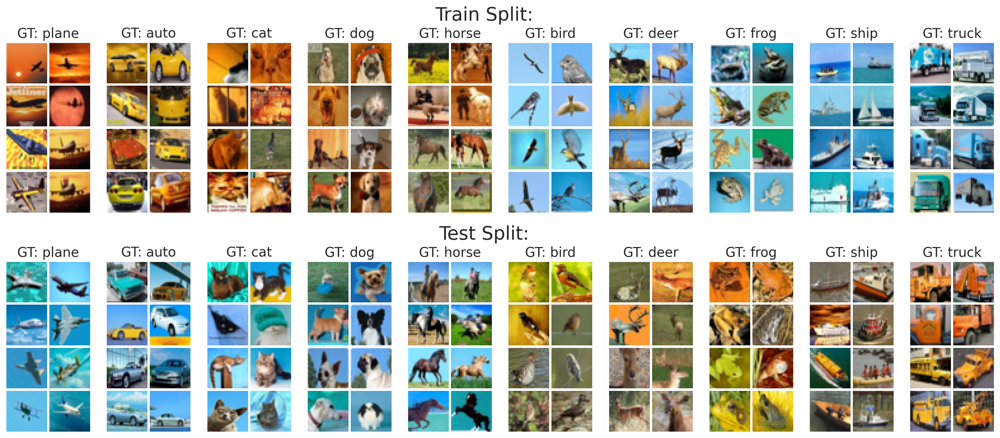

# Task Discovery: Finding the Tasks that Neural Networks Generalize on  <!-- omit in toc -->
[Andrei Atanov](https://andrewatanov.github.io/), [Andrei Filatov](), [Teresa Yao](https://aserety.github.io), [Ajay Sohmshetty](), [Amir Zamir](https://vilab.epfl.ch/zamir/)

 [`Website`](https://taskdiscovery.epfl.ch) | [`arXiv`]() | [`BibTeX`](#citation)


<div align="center" style="padding: 0 100pt">

</div>

## Abstract  <!-- omit in toc -->

When developing deep learning models, we usually decide what task we want to solve then search in the space of models in order to design one that generalizes well on this task. An intriguing question would be: what if, instead of fixing the task and searching in the model space, we fix the model and search in the task space? Can we find tasks that the model generalizes on? How do they look, or do they indicate anything?

This is the question we address in this paper. We propose a task discovery framework that automatically finds examples of such tasks via optimizing a generalization-based quantity called agreement score. With this framework, we demonstrate that the same set of images can give rise to many tasks on which neural networks generalize well. The understandings from task discovery can also provide a tool to shed more light on deep learning and its failure modes: as an example, we show that the discovered tasks can be used to generate "adversarial train-test splits" which make a model fail at test time, without changing the pixels or labels, but by only selecting how the datapoints should be split between training and testing.


## Table of Contents <!-- omit in toc -->
- [Environment setup](#environment-setup)
- [Assets](#assets)
- [Vizualizations](#vizualizations)
- [Running experiments](#running-experiments)
- [Adversarial splits](#adversarial-splits)
  - [CIFAR-10](#cifar-10)
  - [ImageNet](#imagenet)
  - [CelebA](#celeba)


## Environment setup

<!-- ### Conda  -->

To install conda environment please run the following code:

```bash
git clone https://github.com/EPFL-VILAB/TaskDiscovery.git
cd TaskDiscovery
```

Then install environment:

```bash
conda create -n task_discovery -y python=3.8;
source activate task_discovery;
pip install -r requirements.txt;
pip install torch==1.10.0+cu113 torchvision==0.11.1+cu113 torchaudio==0.10.0+cu113 -f https://download.pytorch.org/whl/cu113/torch_stable.html;
```

<!-- ### Docker -->

## Assets 

### Discovered Tasks  <!-- omit in toc -->


* `assets/tasks/discovered.csv` contains 96 discovered tasks: 32 for ResNet-18, 32 for MLP, and 32 for ViT.
* `assets/tasks/agreement_table.csv` contains calculated agreement score for 96 discovered tasks.
* `assets/tasks/ssl-tasks.csv` contains tasks generated using regulated task discovery (with SimCLR) for ResNet-18.
* `assets/tasks/tiny_imagenet_binary_tasks.npy` contains human-labelled binary tasks for TinyImageNet.


### Checkpoints  <!-- omit in toc -->

We provide the following task discovery checkpoints:

- [ResNet-18 with `d=32`](https://github.com/EPFL-VILAB/TaskDiscovery/releases/download/checkpoints/checkpoint_resnet18.ckpt)
- [MLP with `d=32`](https://github.com/EPFL-VILAB/TaskDiscovery/releases/download/checkpoints/checkpoint_mlp.ckpt)
- [ViT with `d=32`](https://github.com/EPFL-VILAB/TaskDiscovery/releases/download/checkpoints/checkpoint_vit.ckpt)
- [ResNet-18 with `d=8`](https://github.com/EPFL-VILAB/TaskDiscovery/releases/download/checkpoints/checkpoint_resnet18_d8.ckpt)


### Adversarial splits <!-- omit in toc -->

You can find adversarial splits in the following directories:
- CIFAR-10: `assets/adversarial_splits/cifar10`
- ImageNet: `assets/adversarial_splits/imagenet`
- CelebA: `assets/adversarial_splits/celeba`

See the [Adversarial splits](#adversarial-splits) section for more information on how to run exepriments.

## Vizualizations

<!-- omit in toc -->
### Discovered tasks
We provide an IPython notebook  [`task_visualization.ipynb`](visualization/task_visualization.ipynb) to visualize and explore the discovered tasks using the provided checkpoints.


<!-- omit in toc -->
### Adversaraial splits
Use [`adversarial_splits_visualization.ipynb`](visualization/adversarial_splits_visualization.ipynb) IPython notebook to visualize and explore the adversarial splits for the CIFAR-10 dataset. See [Adversarial Splits](#adversarial-splits) for more details.




## Running experiments

To run the agreement score computation on provided tasks use the following command:
```
python check_as.py --task_type <real/random/resnet18/mlp/vit/resnet18_d8> --task_idx <IDX (0-31) for resnet18_d8 (0-7)> 
```

E.g., a command for calculating the agreement score for the first task for ResNet-18:

```
python check_as.py --task_type resnet18 --task_idx 0
```

For training two networks on the *random/real* task use the following command:

```
python train-2net.py \
--return_indicies --persistent_workers \
--config configs/as-eval/as-eval-default.yaml \
--name {task_type}-task-{task_idx} --task_type real  --max_epochs 100 \
--task_idx 0 --task_out_type class --dataset cifar10 --arch resnet18
```

To run training on task parameterized by neural network use the following command:

```
python train-2net.py \
--return_indicies --persistent_workers \
--config configs/as-eval/as-eval-default.yaml \
--name {task_type}-task-{task_idx} --task_type real  --max_epochs 100 \
--task_idx 0 --task_out_type class --dataset cifar10 --arch resnet18 \
--task_ckpts checkpoints/checkpoint_resnet_d8.ckpt --task_type emb \
--task_h_dim 8 --emb_lin_task learned --task_idx 0 --task_arch resnet18
```

To run task discovery, use the following command:

```
python train-as-uniformity.py  \
--config configs/as-uniformity-encoder/as-uniformity-default.yaml \
--name {h_dim}-h_dim-N={n_train_images}-uc={uniformity_coef} \
--h_dim 32 --n_linear_tasks 32 --uniformity_coef 25 --task_temp 5 \
--check_val_every_n_epoch 1 --shuffle --dataset cifar10 \
--arch resnet18 --as_arch resnet18 --dataset_path '.'
```

## Adversarial splits
Here, we provide instructions on creating adversarial splits and running the corresponding experiments. See our website and the paper for the description of adversarial splits. Below is the figure describing the process of creating an adversarial split and its comparison to a random split.

<div align="center" style="padding: 0 100pt">

</div>


### CIFAR-10

__- Precomputed adversarial split__  
You can find adversarial splits at [`cifar_splits.torch`](assets/adversarial_splits/cifar10/cifar_splits.torch). Splits have the following form:

```
{
  task_idx_1: [(train_ids_1, test_ids_1), ...],
  task_idx_2: [(train_ids_2, test_ids_2), ...],
  ...
}
 ```
Where the key `task_idx_N` specifies a target human-labelled binary classification task for which the adversarial splits are created (see Sec. 6.1 of the [paper](TODO:) for more details). We provide splits for 8 target tasks, and each task contains 8 splits created using different discovered tasks. Splits are a tuple of two tensors, each specifying indices of train and test set. 

These indices are used in the [following way](https://github.com/EPFL-VILAB/TaskDiscovery/blob/4efab4a331ed8087b4830b7f9ac1fc705083d234/adversarial_splits/cifar10/train.py#L66):

 ```
dataset = torchvision.datasets.CIFAR10(...)

split_ids  =  torch.load(PATH)[TASK_IDX][SPLIT_IDX]

dataset_train = torch.utils.data.Subset(dataset, split_ids[0])
dataset_val = torch.utils.data.Subset(dataset, split_ids[1])
 ```

__- Training on adversarial split__  
To run training with adversarial split use the following command:

```
python adversarial_splits/cifar10/train.py \
--task_idx <TASK_IDX (0-7)> --split_idx <SPLIT_IDX (0-7)> \
--adversarial_splits_path assets/adversarial_splits/cifar10/cifar_splits.torch
```

__- Training on random split__  
To run training with standard random split use the following command:

```
python adversarial_splits/cifar10/train.py \
--task_idx <TASK_IDX (0-7)> --split_idx <SPLIT_IDX>
```

__- 10-way adversarial split__  
The same splits are used for the original target 10-way classification task. In this case, the key corresponds to the class labels split `C_1, C_2` used to create the split (see Sec. 6.2 of the [paper](TODO:) for more details). Use the following code to run adversarial split for 10-way classification:

```
python adversarial_splits/cifar10/train.py \
--task_type real10 --task_idx <TASK_IDX (0-7)> --split_idx <SPLIT_IDX (0-7)> \
--adversarial_splits_path assets/adversarial_splits/cifar10/cifar_splits.torch
```

### ImageNet

__- Precomputed adversarial split__  
You can find the adversarial split at [`adv-split.torch`](assets/adversarial_splits/imagenet/adv-split.torch) and load it via [torch.load](https://pytorch.org/docs/stable/generated/torch.load.html#torch-load). It consists of two arrays of train and test indicies consistent with their appearence in the imagenet dataset.

__- Creating an adversarial split using a random network__  
Use the following command to create an adversarial split:

```
python adversarial_splits/imagenet/random_net_adv_split.py <path to the imagenet training set>
```
Splits will be saved at `./adv-split.torch`.

__- Training a network on an adversarial split__
Use the following command to train on an *adversarial split* (this script is based on the vanilla Imagenet PyTorch [example](https://github.com/pytorch/examples/tree/main/imagenet)):
```bash
python adversarial_splits/imagenet/train.py  \
--arch resnet50 --workers 32 \
--batch-size 256 --save_dir ./logs-adversarial-split/ \
--split <path to a split> <path to the imagenet root directory>
```
For example, from the root directory:
```bash
python adversarial_splits/imagenet/train.py \
--arch resnet50 --workers 32 \
--batch-size 256 --save_dir ./logs-adversarial-split/ 
--split assets/adversarial_splits/imagenet/adv-split.torch \
 <path to the imagenet root directory>
```

Use the following command to train on a *random split*:
```bash
python adversarial_splits/imagenet/train.py \
--arch resnet50 --workers 32 \
--batch-size 256 --save_dir ./logs-random-split/ \
--val_size 0.5 <path to the imagenet root directory>
```

### CelebA

__- Precomputed adversarial split__  
You can find the adversarial split used in the paper at [`list_eval_partition_adv_split.csv`](assets/adversarial_splits/celeba/list_eval_partition_adv_split.csv).

__- Training a network on the adversarial split__  
We use [`run_expt.py`](https://github.com/kohpangwei/group_DRO/blob/master/run_expt.py) from the [DRO](https://github.com/kohpangwei/group_DRO) official repository. Substitute the original `list_eval_partition.csv` file in the dataset folder (see the expected structure [here](https://github.com/kohpangwei/group_DRO#celeba)) with the adversarial partition file `list_eval_partition_adv_split.csv`. We use the following command to train an ERM learner:
```
python run_expt.py \
-s confounder -d CelebA -t Blond_Hair -c Male \
--lr 0.0001 --batch_size 128 --weight_decay 0.0001 \ 
--model resnet50 --n_epochs 51 --log_dir ./cleba_adv_split/ \
--train_from_scratch --root_dir <path to CelebA dataset>
```

We also provide a random split for comparison at [`list_eval_partition_random_split.csv`](assets/adversarial_splits/celeba/list_eval_partition_random_split.csv). Similarly, you can substitute the original partition file with this one and run the same command.


## License  <!-- omit in toc -->

This project is under the MIT license. See [LICENSE](LICENSE.md) for details.

<!-- omit in toc -->
## Citation

```BibTeX
@article{atanov2022task,
  author    = {Atanov, Andrei and Filatov, Andrei and Yeo, Teresa and Sohmshetty, Ajay and Zamir, Amir},
  title     = {Task Discovery: Finding the Tasks that Neural Networks Generalize on},
  journal   = {arXiv preprint arXiv: TBD},
  year      = {2022},
}
```


